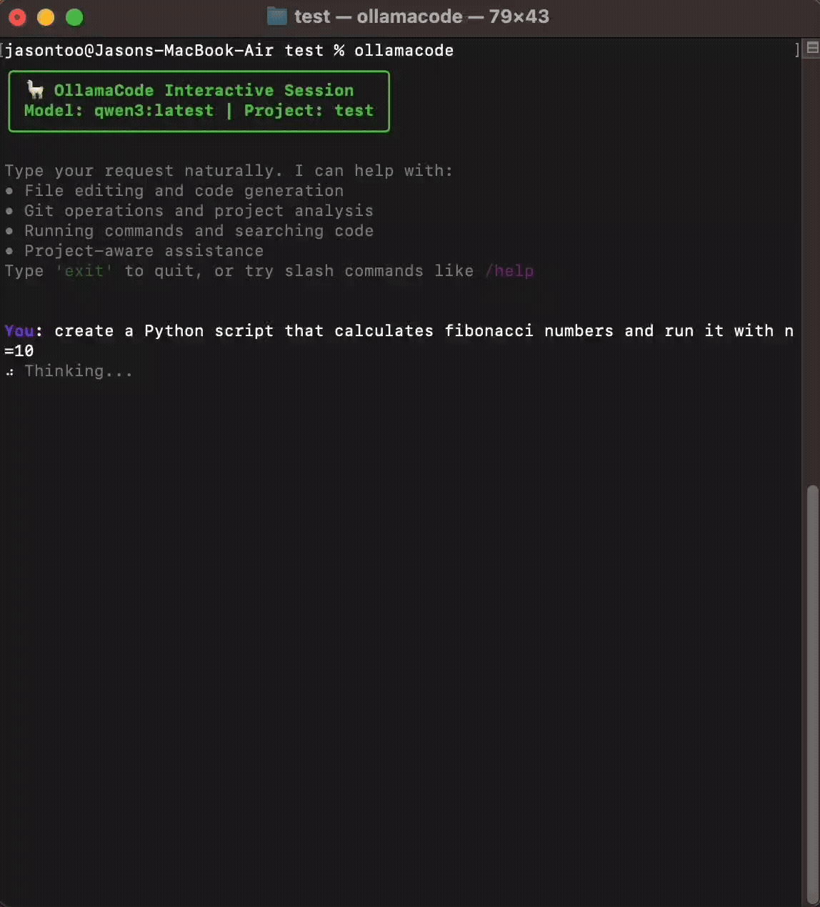

# 🦙 OllamaCode

**An intelligent CLI companion for developers** - An AI coding assistant that executes your requests instead of just generating code blocks.

[](https://www.python.org/downloads/)
[](https://ollama.ai/)
[](LICENSE)

## 🎯 **Why OllamaCode?**

**The Problem with Other AI Assistants:**
```bash
You: "create a Python script that fetches weather data and run it"
Other AI: Here's the code: ```python [shows code block]
You: 😤 Now I have to copy, paste, save, and run it manually...
```

**The OllamaCode Solution:**
```bash
You: "create a Python script that fetches weather data and run it"
OllamaCode: 🔧 Creating weather_fetcher.py...
           🔧 Running python weather_fetcher.py...
           ✅ Current weather: 72°F, sunny ☀️
You: 🎉 It actually works!
```

## 🎬 Live Demos

See OllamaCode in action with these real-world demonstrations:

### Demo 1: Automated Script Creation & Execution
Watch OllamaCode create a Python script from natural language and execute it automatically.



### Demo 2: Git Repository Management  
See how OllamaCode can initialize a git repository and create commits with intelligent commit messages.


### Demo 3: Codebase Analysis & Documentation
Observe OllamaCode studying your codebase and automatically updating documentation.


---

## ✨ Key Features

- 🎯 **Direct Tool Execution** - LLM **calls tools directly** instead of generating code blocks
- 🤖 **AI-Powered Actions** - Create files, run commands, manage git - all automatically
- 📁 **Smart File Operations** - Intelligent code generation and execution from natural language
- 🔧 **Git Workflow Integration** - Complete version control operations with AI assistance
- 🔍 **Code Search & Analysis** - Find patterns, TODOs, and functions across your codebase
- 🎨 **Syntax Highlighting** - Beautiful code display with auto-language detection (14+ languages)
- ⚡ **Caching System** - Fast responses with intelligent caching
- 🛡️ **Safety First** - Permission system for secure file operations
- 💡 **Auto-Completion** - Smart slash commands and file reference completion
- 🚨 **Enhanced Error Messages** - Contextual error handling with actionable suggestions
- 🎯 **Project Context** - Automatically understands your project structure
- 📊 **Session Management** - Save and resume coding sessions
- 🌐 **Network Endpoints** - Connect to remote Ollama servers for powerful models
- ⚙️ **Persistent Config** - Save preferred endpoints and models

## 🚀 Quick Start

### Requirements

- **Python 3.9+**
- **Ollama** with a model that supports **tool calling** (function calling)
- **Tested with:** `qwen3:latest` - recommended for best tool calling support

### Installation

```bash
# Install from source
git clone https://github.com/tooyipjee/ollamacode.git
cd ollamacode
pip install -e .

# Make sure Ollama is running
ollama serve

# Pull a compatible model with tool calling support
ollama pull qwen3:latest

# Start coding!
ollamacode
```

### Basic Usage

```bash
# Interactive mode
ollamacode

# Direct command
ollamacode "explain this code" < script.py

# With specific model
ollamacode --model gemma3 "optimize this function"

# Use remote Ollama server
ollamacode --endpoint http://192.168.1.100:11434

# Set default endpoint permanently
ollamacode --set-endpoint http://gpu-server:11434
```

## 🎯 Core Features in Action

### 🤖 AI-Powered File Creation

Create functional code files from natural language descriptions:

```bash
You: write a file that generates sine wave data and saves as CSV

🦙 OllamaCode creates: sine_wave_generator.py
```

```python
import numpy as np
import pandas as pd
import os

def generate_sine_wave_data(frequency, amplitude, duration, sample_rate):
    """Generate sine wave data with specified parameters."""
    t = np.linspace(0, duration, int(sample_rate * duration))
    sine_wave = amplitude * np.sin(2 * np.pi * frequency * t)
    
    return pd.DataFrame({
        'time': t,
        'amplitude': sine_wave
    })

def save_to_csv(data, filename='sine_wave.csv'):
    """Save data to CSV file."""
    data.to_csv(filename, index=False)
    print(f"✅ Saved {len(data)} data points to {filename}")

if __name__ == "__main__":
    # Generate 5 seconds of 440Hz sine wave
    data = generate_sine_wave_data(frequency=440, amplitude=1.0, duration=5, sample_rate=1000)
    save_to_csv(data)
```

### 🎨 Beautiful Syntax Highlighting

All code responses feature automatic language detection and rich formatting:

````bash
You: show me a Python function for fibonacci

🦙 OllamaCode responds with highlighted code:
```python
def fibonacci(n: int) -> int:
    """Calculate the nth Fibonacci number using dynamic programming."""
    if n <= 1:
        return n
    
    a, b = 0, 1
    for _ in range(2, n + 1):
        a, b = b, a + b
    
    return b
```
````

### 💡 Smart Auto-Completion

Get intelligent suggestions as you type:

```bash
You: /h
💡 Completions: /help, /headless

You: @mai
💡 File suggestions: @main.py, @main.js

You: help me with git
💡 Suggestions: git status, git diff, git log
```

### 🔧 Powerful Slash Commands

Streamline your workflow with built-in commands:

```bash
/help                    # Show all available commands
/model gemma3           # Switch AI models
/status                 # View session information
/clear                  # Clear conversation history
/cache clear            # Clear response cache
/permissions status     # Check operation permissions
/config                 # View current configuration
```

### 📁 File References

Easily reference files in your conversations:

```bash
You: explain @main.py and suggest improvements

🦙 OllamaCode automatically reads and analyzes the file:
```
File: main.py
[Content displayed with syntax highlighting]

Based on your main.py file, here are some improvements...
```

### 🛡️ Smart Permission System

Safe file operations with granular control:

```bash
⚠️  Permission needed to modify files: write to script.py
Allow? (1=once, 2=session, 3=no) : 2
✅ All operations approved for this session

# Use /permissions to manage:
/permissions status      # Check current permissions
/permissions reset       # Reset all permissions
/permissions approve-all # Approve all for session
```

### 🚨 Enhanced Error Messages

Get helpful, actionable error guidance:

```bash
❌ FileNotFoundError
File not found: config.txt

💡 Suggestions:
• Check if the file path is correct
• Use tab completion or `/complete @filename` to find files  
• Try using absolute paths instead of relative paths

For more help:
• Type `/help` for available commands
• Report issues: https://github.com/tooyipjee/ollamacode/issues
```

### ⚡ Intelligent Caching

Lightning-fast responses for repeated queries:

```bash
You: explain how bubble sort works
⠋ Thinking...          # First time: AI generates response

You: explain how bubble sort works  
💨 Cached response      # Instant response from cache!

/cache status           # View cache statistics
Cache: 15 entries, 2.3 MB, 85% hit rate
```

### 🎯 Project Context Awareness

OllamaCode automatically understands your project:

```bash
🔍 Project context automatically loaded
📍 Project: Python Web API (FastAPI)
📁 Found: requirements.txt, main.py, models/, tests/

You: add error handling to my API

🦙 Response considers your FastAPI project structure:
"I'll help you add comprehensive error handling to your FastAPI application..."
```

### 📊 Session Management

Save and resume your coding sessions:

```bash
# Sessions are auto-saved
Session saved as session_1234567890

# Resume later
ollamacode --resume
Continuing session session_1234567890

# List all sessions
/sessions
• session_1234567890 - 15 messages - 2024-01-15 14:30
• session_1234567891 - 8 messages - 2024-01-15 15:45
```

## 🌐 Network & Remote Endpoints

OllamaCode supports connecting to Ollama servers running on different machines, allowing you to leverage more powerful hardware for heavy models.

### Quick Start with Remote Endpoints

```bash
# Use a remote server temporarily
ollamacode --endpoint http://192.168.1.100:11434 "explain this algorithm"

# Set as your default endpoint
ollamacode --set-endpoint http://gpu-server:11434
ollamacode --set-model llama3.1:70b

# Now all sessions use the remote server
ollamacode "help me optimize this code"
```

### Common Network Scenarios

**Home Lab Setup:**
```bash
# Powerful desktop as Ollama server (192.168.1.100)
# Laptop for development
ollamacode --set-endpoint http://192.168.1.100:11434
ollamacode --set-model llama3.1:70b
```

**Cloud Deployment:**
```bash
# Remote server with GPU acceleration
ollamacode --set-endpoint https://my-ollama-server.com:11434
ollamacode --set-model qwen2.5-coder:32b
```

**Development Team:**
```bash
# Shared team server
ollamacode --set-endpoint http://team-ai-server:11434
ollamacode --set-model codellama:34b
```

### Endpoint Management

```bash
# View current configuration
ollamacode --config-only
{
  "ollama_url": "http://gpu-server:11434",
  "default_model": "llama3.1:70b"
}

# Switch back to local temporarily
ollamacode --endpoint http://localhost:11434 "quick test"

# Switch back to local permanently
ollamacode --set-endpoint http://localhost:11434
```

## 🔧 Advanced Usage

### Multiple Models

Switch between different Ollama models seamlessly:

```bash
You: /model
Current model: gemma3

You: /model codellama
✅ Switched to model: codellama

You: /model qwen2
✅ Switched to model: qwen2
```

### Headless Mode

Perfect for scripts and automation:

```bash
# Single command
echo "def hello():" | ollamacode "complete this function"

# Batch processing
ollamacode "review this code for security issues" < app.py > review.md

# With specific model
cat large_file.py | ollamacode --model gemma3 "summarize this code"
```

### Git Integration

Built-in git operations awareness:

```bash
You: what files have I changed?

🦙 Git Repository Status:
📍 Branch: feature/new-api
✨ Clean: False
📝 Modified: api/routes.py, models/user.py
📋 Staged: tests/test_auth.py
❓ Untracked: config/new_settings.py

You: help me write a commit message

🦙 Based on your changes, here's a suggested commit message:
"feat: enhance user authentication with new routes and tests"
```

## 🎨 Supported Languages

Syntax highlighting and intelligent assistance for:

- **Python** - Full support with pip, virtual environments
- **JavaScript/TypeScript** - Node.js, React, frameworks
- **Rust** - Cargo projects, error handling
- **Go** - Modules, standard library
- **Java** - Maven/Gradle projects
- **C/C++** - CMake, standard libraries  
- **HTML/CSS** - Web development
- **Bash/Shell** - Script automation
- **SQL** - Database queries
- **JSON/YAML** - Configuration files
- **Markdown** - Documentation
- And more!

## ⚙️ Configuration

### Basic Configuration

```bash
# View current config
/config

Ollama URL: http://localhost:11434
Model: gemma3
Project Root: /Users/dev/my-project
Context Dir: .ollamacode
```

### Command Line Configuration

```bash
# View current configuration
ollamacode --config-only

# Set default endpoint (saves to ~/.ollamacode/config.json)
ollamacode --set-endpoint http://192.168.1.100:11434

# Set default model
ollamacode --set-model llama3.1:70b

# Use different endpoint temporarily (doesn't save)
ollamacode --endpoint http://localhost:11434
```

### Environment Variables

```bash
export OLLAMA_URL="http://localhost:11434"
export OLLAMA_MODEL="gemma3"
export OLLAMACODE_CONTEXT_DIR=".ollamacode"
```

### Project Configuration

Create `.ollamacode/config.json` in your project:

```json
{
  "ollama_url": "http://gpu-server:11434",
  "default_model": "llama3.1:70b",
  "auto_save_sessions": true,
  "show_diff_preview": true,
  "cache_enabled": true,
  "syntax_highlighting": true
}
```

### Network Setup Examples

```bash
# Local development
ollamacode --set-endpoint http://localhost:11434
ollamacode --set-model gemma3

# Use powerful GPU server for heavy models
ollamacode --set-endpoint http://192.168.1.100:11434
ollamacode --set-model llama3.1:70b

# Cloud deployment
ollamacode --set-endpoint http://my-ollama-server.com:11434
ollamacode --set-model qwen2.5-coder:32b
```

## 🤝 Contributing

We welcome contributions! Please see our [Contributing Guide](CONTRIBUTING.md) for details.

### Development Setup

```bash
git clone https://github.com/tooyipjee/ollamacode.git
cd ollamacode
pip install -e .[dev]

# Run tests
python -m pytest tests/

# Run specific test suites
python tests/test_file_creation.py
python tests/test_error_handling.py
```

## 📚 Documentation

- [Installation Guide](docs/installation.md)
- [Configuration](docs/configuration.md)
- [Advanced Features](docs/advanced.md)
- [API Reference](docs/api.md)
- [Troubleshooting](docs/troubleshooting.md)

## 🐛 Troubleshooting

### Common Issues

**Ollama not running:**
```bash
# Start Ollama service
ollama serve

# Verify it's running
curl http://localhost:11434/api/version
```

**Model not available:**
```bash
# Pull the model
ollama pull gemma3

# List available models
ollama list
```

**Permission errors:**
```bash
# Use auto-approval for session
/permissions approve-all

# Or approve individual operations as prompted
```

**Cache issues:**
```bash
# Clear the cache
/cache clear

# Check cache status
/cache status
```

**Endpoint connection issues:**
```bash
# Test if remote Ollama server is accessible
curl http://192.168.1.100:11434/api/version

# Check current endpoint configuration
ollamacode --config-only

# Reset to localhost if having issues
ollamacode --set-endpoint http://localhost:11434

# Test with temporary endpoint override
ollamacode --endpoint http://localhost:11434 "test connection"
```

## 📄 License

This project is licensed under the MIT License - see the [LICENSE](LICENSE) file for details.

## 🙏 Acknowledgments

- [Ollama](https://ollama.ai/) for the amazing local LLM platform
- [Rich](https://github.com/Textualize/rich) for beautiful terminal formatting
- The open-source community for inspiration and feedback

---

**Ready to supercharge your coding workflow?** 🚀

```bash
pip install ollamacode
ollamacode
```

*Happy coding with AI! 🦙✨*